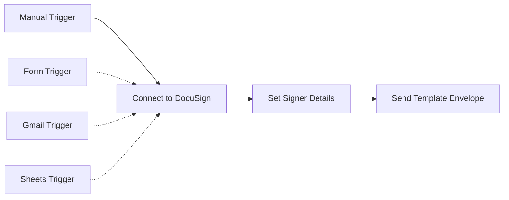

# Send DocuSign Automation

An n8n workflow automation that streamlines the process of sending DocuSign envelopes using templates to prospects and clients.

## Overview

This workflow connects to your DocuSign account and automatically sends document templates to specified recipients. It supports multiple trigger types including manual testing, form submissions, Gmail triggers, and Google Sheets integration.

## Workflow Components

### 🎯 **Trigger Options** (Multiple Available)
- **Manual Trigger**: For testing - manually enter name and email
- **Form Trigger**: Webhook form submissions *(disabled by default)*
- **Gmail Trigger**: Process emails automatically *(disabled by default)*  
- **Google Sheets Trigger**: Monitor sheet for new rows *(disabled by default)*

### 🔗 **Core Workflow Steps**
1. **Connect to DocuSign Account** - Authenticates and retrieves account information
2. **Set Signer Details** - Prepares account ID, base path, signer name, and email
3. **Send Template Envelope** - Creates and sends the DocuSign envelope using your template

## Features

- ✅ Multiple trigger options for different use cases
- ✅ OAuth2 authentication with DocuSign
- ✅ Template-based envelope creation
- ✅ Automatic account and base path detection
- ✅ Built-in documentation via sticky notes
- ✅ Ready for production use

## Prerequisites

### DocuSign Requirements
- DocuSign Developer Account ([Sign up here](https://developers.docusign.com/))
- DocuSign template uploaded with "Signer" role configured
- OAuth2 app configured in DocuSign Admin panel

### n8n Requirements
- n8n account (cloud or self-hosted)
- OAuth2 credentials configured for DocuSign

## Quick Setup Guide

### 1. DocuSign Configuration
1. **Log into DocuSign Admin** → Apps and Keys → Add App
2. **Copy Integration ID** and save it
3. **Click PKCE** → Add Secret → Copy and save secret
4. **Create Template** in DocuSign with "Signer" role
5. **Get Template ID** from Templates → Double-click template → Copy Template ID

### 2. n8n Configuration
1. **Add Credentials** in n8n → Overview → Credentials → "+"
2. **Select "OAuth2 API"** credential type
3. **Add your DocuSign values** (Integration ID, Secret, etc.)
4. **Copy Redirect URL** from n8n and paste to DocuSign app URI
5. **Import workflow** from `workflows/send-docusign-automation.json`
6. **Select your OAuth2 credential** in the workflow nodes

### 3. Customize for Your Use
1. **Update Template ID** in "Send Template Envelope" node:
   ```json
   "templateId": "YOUR_TEMPLATE_ID_HERE"
   ```
2. **Set default signer values** in "Set for signerName and signerEmail" node
3. **Enable desired triggers** (Form, Gmail, Sheets) as needed
4. **Test the workflow** using the manual trigger

## Workflow Structure



## Configuration Details

### Template Configuration
The workflow uses a hardcoded template ID in the "Send Template Envelope" node:
- Current template: `c3746378-a6d3-4caa-aeeb-15e3587a4af4`
- Role: "Signer" 
- Status: "sent" (immediately sends to recipient)

### OAuth2 Endpoint
- Demo environment: `https://account-d.docusign.com/oauth/userinfo`
- Production: Update URL to `https://account.docusign.com/oauth/userinfo`

### API Endpoint Pattern
```
{basePath}/v2.1/accounts/{accountId}/envelopes
```
Where `basePath` and `accountId` are automatically extracted from your DocuSign account.

## Usage Examples

### Manual Testing
1. Activate the workflow
2. Click "Execute Workflow" on the Manual Trigger
3. Workflow will use default values from "Set" node

### Form Integration
1. Enable the Form Trigger node
2. Configure form fields to map to `signerName` and `signerEmail`
3. Use the webhook URL in your external forms

### Gmail Integration  
1. Enable Gmail Trigger node
2. Configure email filters as needed
3. Parse email content for recipient details

### Google Sheets Integration
1. Enable Google Sheets Trigger node
2. Configure sheet ID and range
3. Map columns to signer name and email

## Customization

### Adding Dynamic Template Selection
Modify the "Set" node to include template selection:
```json
{
  "templateId": "{{ $json.templateChoice }}",
  "templateRoles": [...]
}
```

### Adding Error Handling
Add IF nodes and error handling between steps for production robustness.

### Adding Validation
Include email validation and data sanitization before sending.

## Environment Variables

For production deployment, consider using environment variables:
- `DOCUSIGN_TEMPLATE_ID`: Your template ID
- `DOCUSIGN_ENVIRONMENT`: demo or production
- `DEFAULT_SIGNER_EMAIL`: Fallback email address

## Troubleshooting

### Common Issues
1. **"Invalid Integration Key"** - Check your OAuth2 credentials
2. **"Template not found"** - Verify template ID and sharing permissions  
3. **"User not found"** - Ensure OAuth2 authentication is working
4. **"Envelope creation failed"** - Check template role names match exactly

### Debug Mode
Enable debug logging in n8n to see detailed request/response data.

## Security Notes

- OAuth2 credentials are stored securely in n8n
- Template IDs and account details are dynamically retrieved
- Consider adding input validation for production use
- Review DocuSign permissions and access controls

## Support

- [n8n Documentation](https://docs.n8n.io/)
- [DocuSign API Documentation](https://developers.docusign.com/)
- [Issues](https://github.com/deepthinklabs-ai/send-docusign-automation/issues)

## Contributing

See [CONTRIBUTING.md](CONTRIBUTING.md) for guidelines on contributing to this project.

## License

This project is licensed under the MIT License - see [LICENSE](LICENSE) for details.
